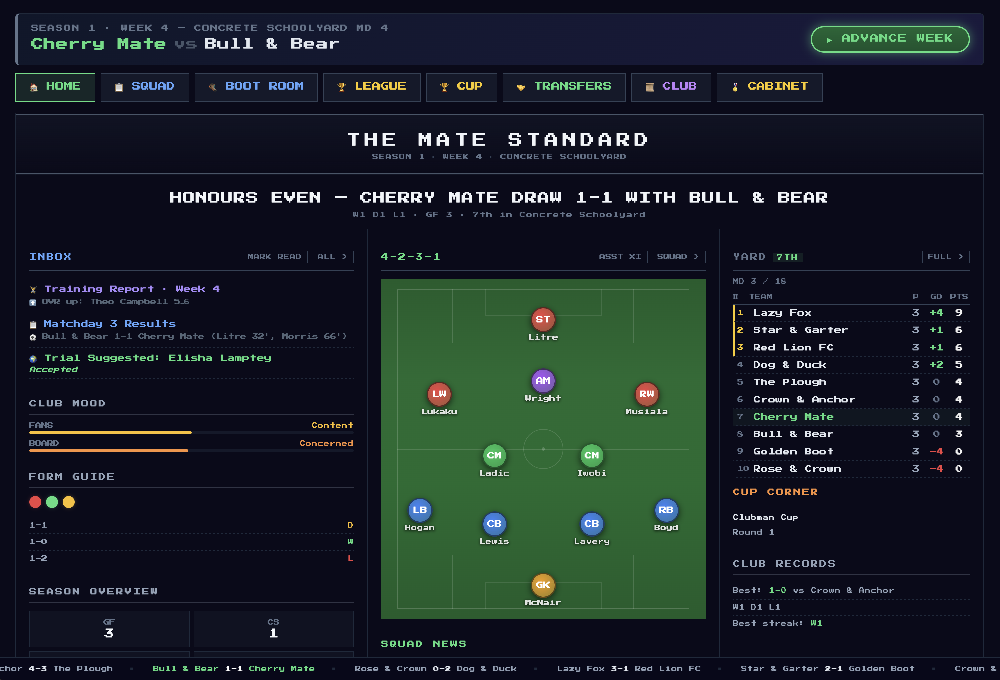
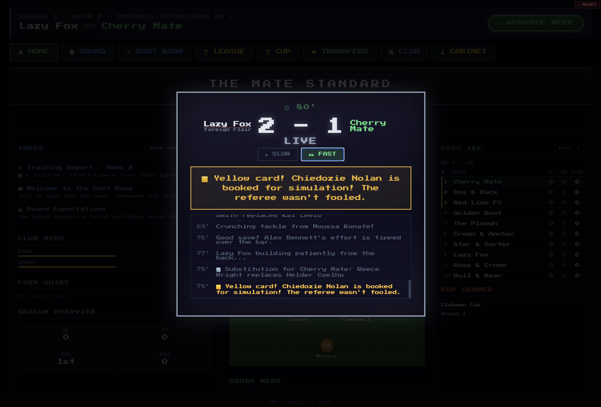
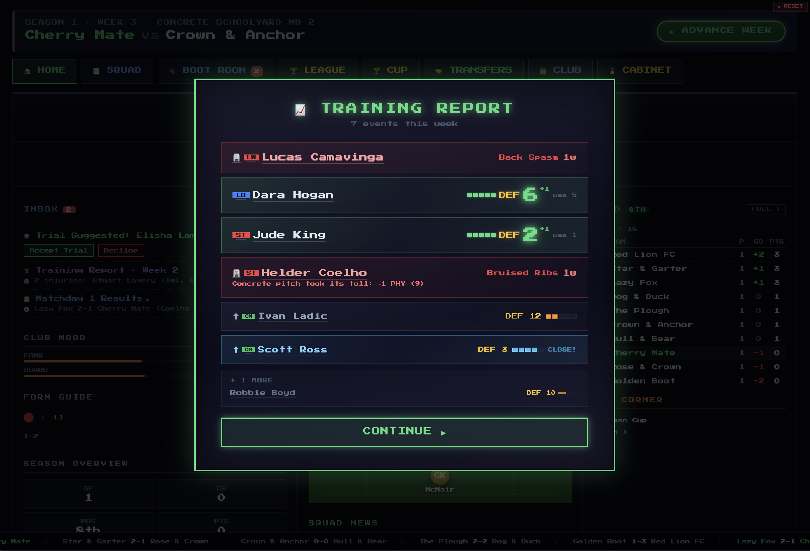
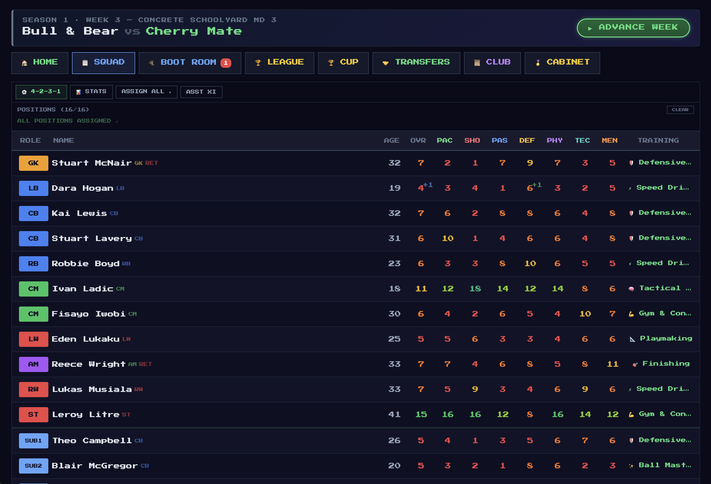
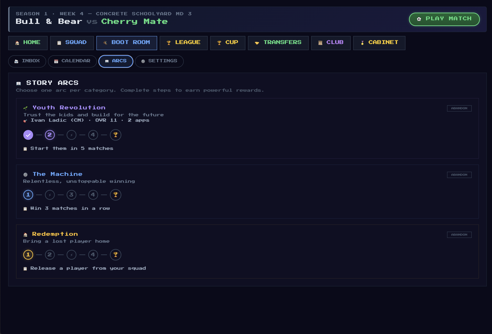

# Jumpers for Goalposts

Build your team, go from the schoolyard to the top of the football pyramid, one +1 at a time. Jumpers for Goalposts is a retro football sim that revels in simple pleasures and gives you space to create your own narrative.

A love letter to FIFA, Championship Manager, Ultimate Soccer Manager, and This Is Football.

---



## Features

**11-tier league pyramid** — Work your way up from the Concrete Schoolyard to the Intergalactic Elite. Each league has its own identity, rules, and gameplay modifiers.

**Match simulation** — Live text commentary with goals, cards, substitutions, and tactical shifts. Watch it unfold or skip ahead.



**Training & development** — Every week your players train. Watch attributes tick up one point at a time. Injuries happen. Breakthroughs happen. The +1 never gets old.



**Squad management** — Set formations, assign roles, manage your bench. Every player has 7 attributes, a position, a potential, and a story.



**Story arcs** — Multi-step narrative challenges that reward you for how you play. Youth Revolution, The Machine, Redemption, and more.



**Transfers** — Scout, trial, sign, and sell. Build relationships with rival clubs. Raid their squads or watch them raid yours.

**Cup competitions** — Knockout tournaments running alongside the league. Giant-killings included.

**Prestige system** — Win the top league and prestige to reset with higher OVR caps, tougher AI, and a fresh pyramid to climb.

**Unlockable players** — Hit achievements and earn unique players with their own flavour text and boosted stats.

**Ironman mode** — One save, no reloading. Get sacked and it's over.

## Tech

- React + Vite
- No backend — runs entirely in the browser
- Saves to localStorage (export/import supported)
- `Press Start 2P` pixel font throughout

## Running locally

```
npm install
npx --no vite
```

Opens at `http://localhost:5173`.
